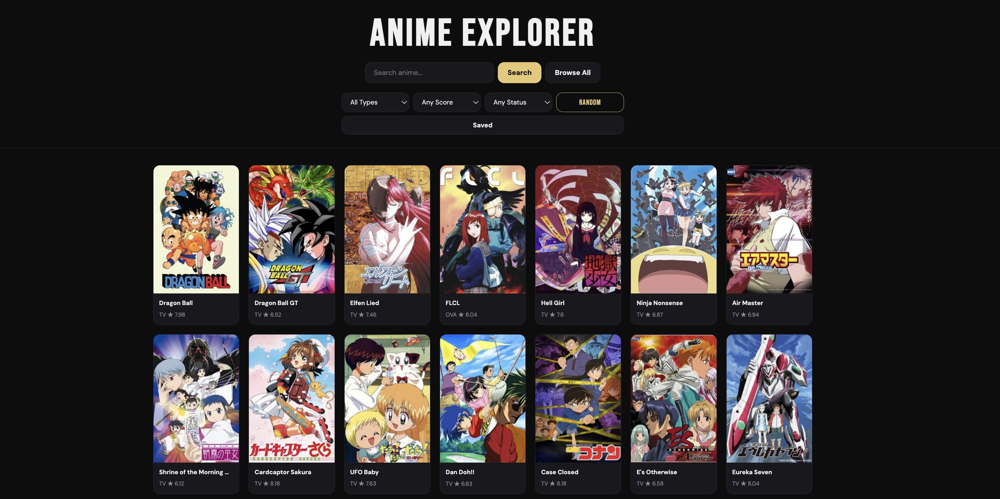
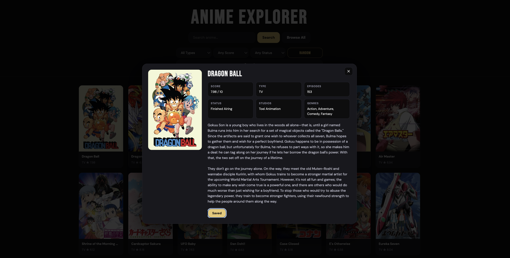
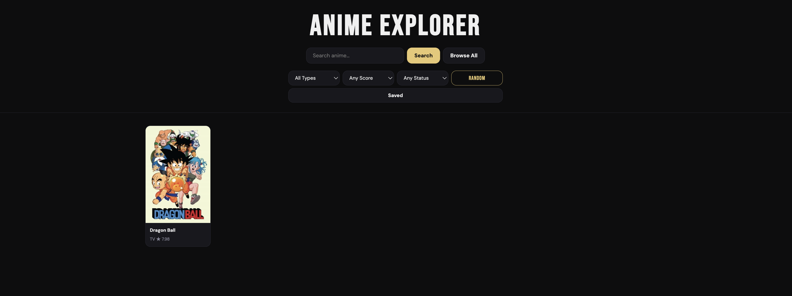

# Anime Explorer

Anime Explorer is a web application that lets users search, browse, filter, and save anime using live data from the Jikan (MyAnimeList) API. The app connects to an external API, loads results in pages, allows filtering, shows details in a pop-up window, and saves favorites in the browser using local storage.

---

Ai Usage: [View Documentation](https://docs.google.com/document/d/1Bs2bp5pbq0skzaUaQhxRokhxhmveg--JVWugvN_1kRA/edit?usp=sharing)

---

## Team Members

* Ibrahima
* Zulka

---

## API

**API:** Jikan REST API (Unofficial MyAnimeList API)
Base URL:

```
https://api.jikan.moe/v4/anime
```

### Endpoints Used

**GET /v4/anime**

* `q` – search query
* `type` – tv or movie
* `min_score` – minimum rating filter
* `status` – airing or finished
* `page` – pagination
* `limit` – number of results

**GET /v4/anime/{id}**

* Retrieves detailed anime information by MAL ID

---

## Features

* Search for anime by name
* Browse anime results
* Filter by type, rating, and status
* Get a random anime suggestion
* View full anime details in a pop-up
* Load more results
* Save anime to favorites

---

## Setup Instructions

### Install dependencies

```
npm install
```

### Run development server

```
npm run dev
```

---

## Screenshots

### HomePage


### Pop Up Menu


### bookMark tab
